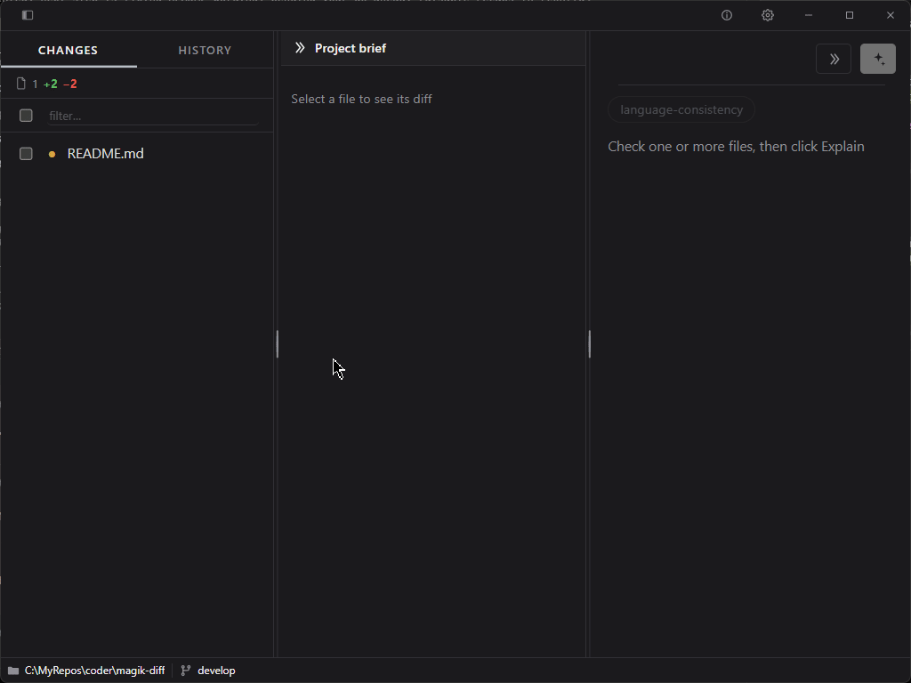

# Magik Diff


A native git diff viewer with an on-demand LLM explanation pane — covering a single file, all tracked changes, or any past commit. Human review stays in the loop; the model gets you there faster.



## Why?

Diff tools tell you *what* changed. Magik Diff adds a right-hand pane explaining *why* it matters — scroll-locked to the diff, triggered only on request, never automatically and never per hunk. You still review and decide; the model shortens the path. Strictly read-only: nothing is ever staged, committed, or checked out.

## Split view

Each file's diff renders as unified (`+`/`-` inline) or split (old file on the left, new on the right, changes tinted). The Unified/Split toggle sits next to the file name and persists across files.

## Shortcuts

| Keys | Action |
| --- | --- |
| `Ctrl/Cmd` + `M` | Open model config |
| `Ctrl/Cmd` + `B` | Show/hide the Changes/History pane |
| `Ctrl/Cmd` + `+` / `-` | Zoom in / out |
| `Ctrl/Cmd` + `0` | Reset zoom |
| `F11` | Toggle zen mode |
| `Esc` | Close open menu |

## Checks

Alongside the built-in explanation, you can run user-defined checks against any diff or commit — each is an independent LLM call with its own prompt. A check is a Markdown file with a front matter block (`name`, `description`, `color`) and a prompt body; `checks/language-consistency.md` is a working example. Install one via the CLI:

```sh
mdiff check add path/to/my-check.md
```

Installed checks appear as buttons beside Explain, with resizable result panels.

## CLI

```sh
mdiff                          launch the GUI
mdiff check add <file.md>      install a check
mdiff --version, -v            show version
mdiff --help, -h               show this help
```

## Build

A native desktop binary built with [Wails](https://wails.io) (Go backend, React frontend); it must be compiled on the target OS.

### Windows

```sh
./build-win.ps1
```

Builds `build/bin/mdiff.exe`.

### Linux

```sh
./build-linux.sh
```

Builds `build/bin/mdiff` (amd64, webkit2_41).

### macOS

No build script yet; use Wails directly:

```sh
wails build
```

## Requirements

- Go >= 1.25
- [Wails CLI](https://wails.io/docs/gettingstarted/installation)
- Node.js (for the frontend build, invoked automatically by Wails)
- An OpenAI-compatible HTTP endpoint for the explain feature (any provider, no SDK lock-in)

## License

MIT © [koder0x](https://github.com/gsscoder)
