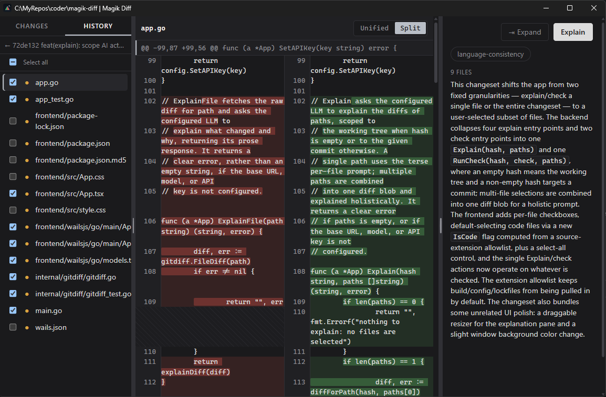

# Magik Diff


A native git diff viewer with an LLM-powered explain-on-demand pane — for one file, all tracked changes, or a past commit. Human-in-the-loop becomes AI-powered-human-in-the-loop.



## Why?

Diff tools show you *what* changed. Magik Diff adds a right-hand pane that explains *why* it matters, scroll-locked to the diff and generated only when you ask for it — never automatically, never per-hunk. You still review and decide, the model just gets you there faster. It's read-only: it never stages, commits, or checks out anything.

## Split view

Each file's diff can render as unified (`+`/`-` inline) or split (old file left, new file right, changes tinted). Toggle with the Unified/Split control next to the file name — the choice is sticky across files.

## Shortcuts

| Keys | Action |
| --- | --- |
| `Ctrl/Cmd` + `L` | Open LLM configuration |
| `Ctrl/Cmd` + `+` / `-` | Zoom in / out |
| `Ctrl/Cmd` + `0` | Reset zoom |

## Checks

Beyond the LLM explanation, you can run user-defined checks against a diff or commit — each one a separate, independent LLM call with its own prompt. A check is a Markdown file with a small front matter block (`name`, `description`, `color`) followed by the prompt body; see `checks/language-consistency.md` for an example. Install one with the CLI:

```sh
mdiff check add path/to/my-check.md
```

Installed checks show up as buttons next to Explain, with resizable results.

## CLI

```sh
mdiff                          launch the GUI
mdiff check add <file.md>      install a check
mdiff --version, -v            show version
mdiff --help, -h               show this help
```

## Build

Native desktop binary built with [Wails](https://wails.io) (Go backend + React frontend), so it must be built on the target OS.

### Windows

```sh
./build-win.ps1
```

Builds `build/bin/mdiff.exe`.

### Linux

```sh
./build-linux.sh
```

Builds `build/bin/mdiff` (amd64, webkit2_41).

### macOS

No build script yet — build directly with Wails:

```sh
wails build
```

## Requirements

- Go >= 1.25
- [Wails CLI](https://wails.io/docs/gettingstarted/installation)
- Node.js (for the frontend build, invoked automatically by Wails)
- An OpenAI-compatible HTTP endpoint for the explain feature (any provider, no SDK lock-in)

## License

MIT © [koder0x](https://github.com/gsscoder)
